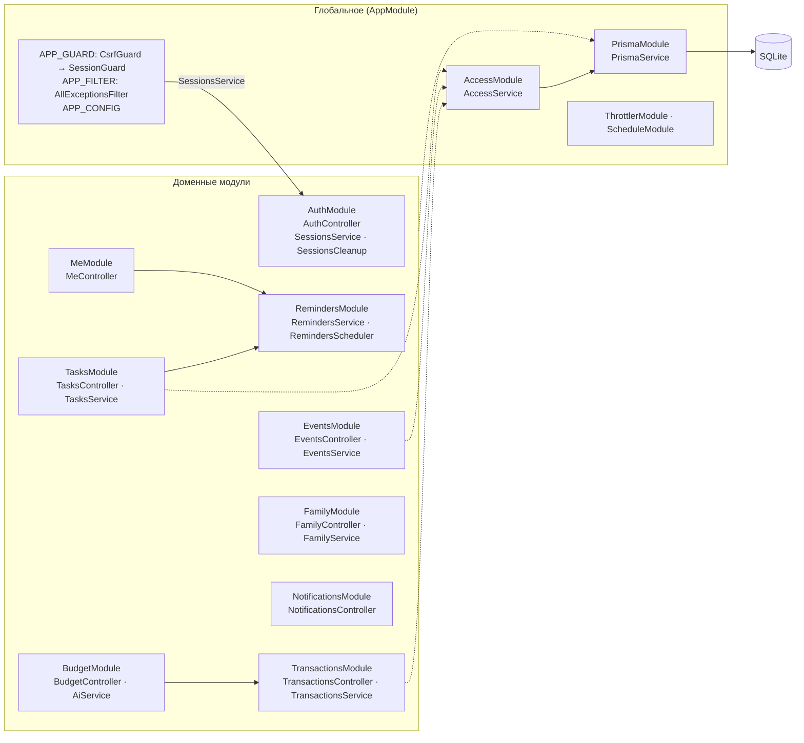
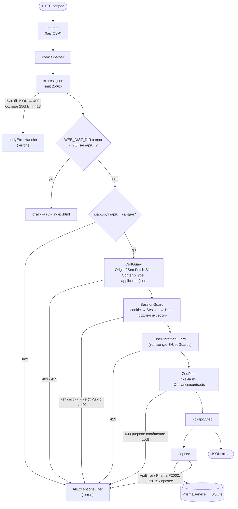
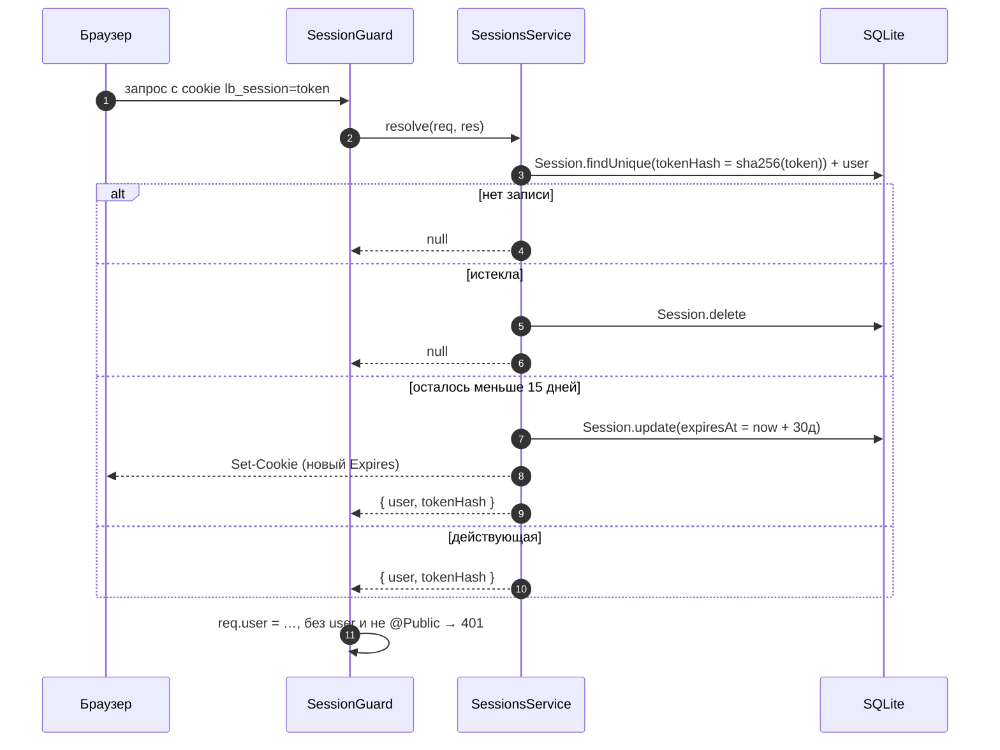
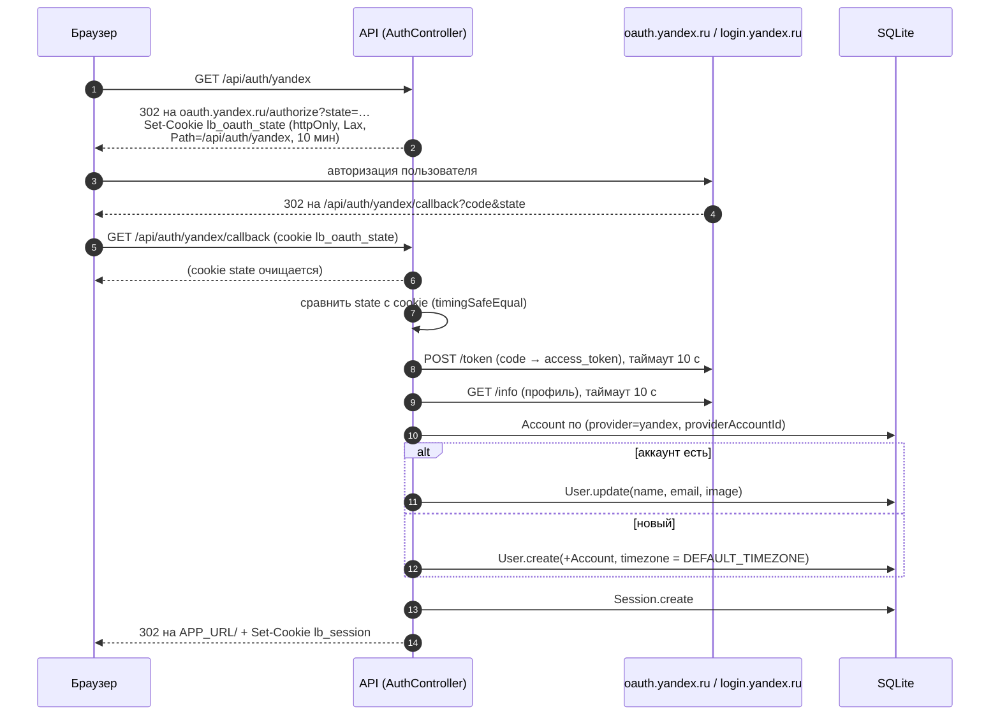
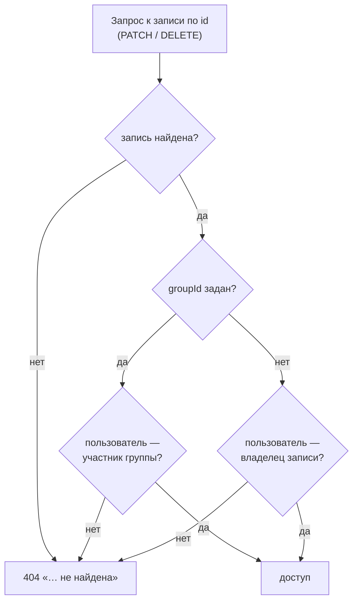
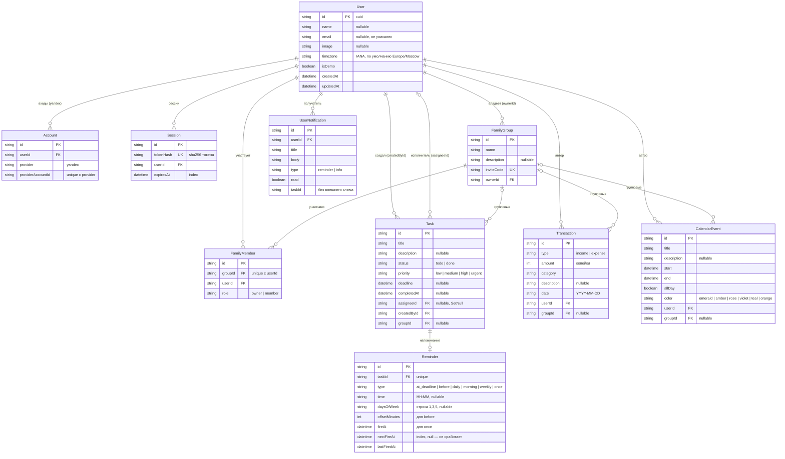
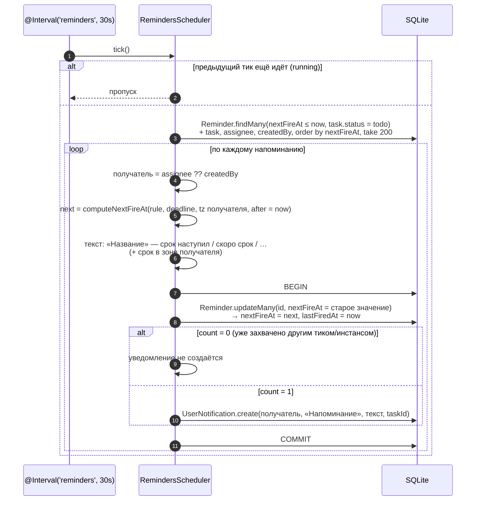

# Обзор API (`apps/api`)

Документ описывает, как устроен бэкенд на момент перехода к рефакторингу: из чего он состоит,
как проходит запрос, как работают вход, доступ к данным и напоминания, какие есть эндпоинты
и что покрыто тестами. В конце — наблюдения и кандидаты на рефакторинг. План рефакторинга
будет отдельным документом после согласования этого обзора.

Состояние кода — ветка `develop`, коммит `4be3d2f`.

## Содержание

1. [Коротко](#коротко)
2. [Структура каталогов](#структура-каталогов)
3. [Архитектура: модули Nest](#архитектура-модули-nest)
4. [Жизненный цикл запроса](#жизненный-цикл-запроса)
5. [Авторизация и сессии](#авторизация-и-сессии)
6. [Модель доступа](#модель-доступа)
7. [Модель данных](#модель-данных)
8. [Напоминания](#напоминания)
9. [Эндпоинты](#эндпоинты)
10. [Фоновые задачи](#фоновые-задачи)
11. [Конфигурация](#конфигурация)
12. [Тесты](#тесты)
13. [Наблюдения и кандидаты на рефакторинг](#наблюдения-и-кандидаты-на-рефакторинг)

## Коротко

- **Стек:** NestJS 11 на Express 5, Prisma 6 + SQLite, zod 4, `@nestjs/schedule`, `@nestjs/throttler`,
  `date-fns-tz`. Сборка — `nest build` (SWC), тесты — Vitest + supertest на отдельной SQLite-базе.
- **Контракт с фронтендом** — пакет `@balance/contracts`: zod-схемы входа и TypeScript-типы DTO ответа.
  Входные данные валидируются этими схемами на сервере (`ZodPipe`), ответы — только типами при компиляции.
- **Все маршруты под префиксом `/api`.** Ответы — JSON; любая ошибка — `{ "error": "<сообщение на русском>" }`.
- **Авторизация** — серверные сессии в cookie (httpOnly, SameSite=Lax). Вход через Яндекс ID (OAuth)
  или демо-вход (только вне production). CORS не включён: фронтенд и API работают с одного origin
  (в dev — через прокси Vite, в проде API может сам раздавать собранный фронтенд).
- **Предметная область:** личные и семейные (групповые) задачи с напоминаниями, операции бюджета
  (суммы в копейках) с месячной сводкой и ИИ-анализом, события календаря, семейные группы
  по коду приглашения, внутренние уведомления.
- **Фоновые задачи:** тик напоминаний каждые 30 с и ежечасная очистка просроченных сессий.

## Структура каталогов

```
apps/api/
├── prisma/
│   ├── schema.prisma            модель данных (SQLite)
│   └── migrations/              одна миграция init
├── src/
│   ├── main.ts                  точка входа: .env → loadConfig → createApp → listen
│   ├── bootstrap.ts             createApp: middleware, префикс /api, раздача SPA
│   ├── app.module.ts            корневой модуль: глобальные guards, фильтр, планировщик
│   ├── config/                  app-config.ts (env → AppConfig), inject-config.ts (@InjectConfig)
│   ├── common/                  ApiError, AllExceptionsFilter, CsrfGuard, ZodPipe,
│   │                            UserThrottlerGuard, @Public, @CurrentUser, AppRequest
│   ├── prisma/                  PrismaModule (global), PrismaService
│   ├── modules/
│   │   ├── access/              AccessService — членство в группах (global)
│   │   ├── auth/                AuthController, SessionsService, SessionGuard, SessionsCleanup, yandex.ts
│   │   ├── me/                  MeController — профиль
│   │   ├── tasks/               TasksController, TasksService, task.mapper.ts
│   │   ├── reminders/           RemindersService, RemindersScheduler, schedule.ts, reminder-data.ts
│   │   ├── transactions/        TransactionsController, TransactionsService, scope.ts
│   │   ├── budget/              BudgetController, AiService, budget-summary.ts
│   │   ├── events/              EventsController, EventsService
│   │   ├── family/              FamilyController, FamilyService
│   │   └── notifications/       NotificationsController
│   ├── seed/demo.ts             демо-пользователи и данные
│   └── scripts/seed.ts          pnpm db:seed
└── test/                        API-тесты (supertest) и тесты расчёта расписания
```

Принятая схема слоёв (README): контроллер → сервис → `PrismaService`. Соблюдается не везде — см.
[наблюдения](#наблюдения-и-кандидаты-на-рефакторинг).

## Архитектура: модули Nest

`AppModule.forRoot(config)` — динамический глобальный модуль. Он регистрирует конфигурацию под
DI-токеном `APP_CONFIG`, глобальный фильтр ошибок и два глобальных guard'а, а `ScheduleModule`
подключает только при `schedulerEnabled` (в тестах выключен).



Сплошные стрелки между модулями — явный `imports`; `SessionGuard` использует `SessionsService`
из `AuthModule`; пунктир — использование глобальных провайдеров. Prisma напрямую используют все
доменные модули. `NotificationsModule` никто не импортирует: планировщик напоминаний пишет
в таблицу `UserNotification` сам.

| Модуль        | Что делает                                                                                     | Зависит от                   |
| ------------- | ---------------------------------------------------------------------------------------------- | ---------------------------- |
| Access        | `memberGroupIds`, `isMember`, `assertMember` (403), `canAccess` (личное/групповое)             | Prisma                       |
| Auth          | `/config`, `/session`, вход Яндекс/демо, выход; сессии; ежечасная очистка                      | Prisma, Config, `seed/demo`  |
| Me            | чтение и изменение профиля (имя, часовой пояс); при смене зоны — пересчёт напоминаний          | Prisma, Reminders            |
| Reminders     | расчёт `nextFireAt`, пересчёт при изменении задачи/пользователя, тик планировщика              | Prisma                       |
| Tasks         | CRUD задач с напоминанием и исполнителем                                                       | Prisma, Access, Reminders    |
| Transactions  | CRUD операций за месяц; `monthWhere` — общий фильтр «месяц + контекст» (используется в Budget) | Prisma, Access               |
| Budget        | месячная сводка; ИИ-анализ через OpenAI-совместимый API (`AiService`)                          | Prisma, Transactions, Config |
| Events        | CRUD событий календаря, выборка по пересечению с диапазоном                                    | Prisma, Access               |
| Family        | группы: создание, вступление по коду, новый код, выход с передачей владения, удаление          | Prisma                       |
| Notifications | список уведомлений (последние 50) и отметка «прочитано»                                        | Prisma                       |

Отдельного модуля «AI» нет: `AiService` живёт в `BudgetModule` и используется только для анализа бюджета.

## Жизненный цикл запроса

`bootstrap.ts` создаёт приложение с `bodyParser: false` и вручную ставит middleware Express,
затем Nest выполняет guards, pipes, контроллер и фильтр ошибок.



Подробности по шагам:

- **helmet** — заголовки безопасности; CSP выключен, потому что SPA использует inline-скрипт темы.
  `x-powered-by` отключён, `trust proxy` = `loopback` (IP клиента берётся из `X-Forwarded-For`,
  только если прокси на том же хосте).
- **express.json({ limit: '256kb' })** разбирает только `application/json`. Ошибки разбора
  перехватывает `bodyErrorHandler`: `entity.too.large` → 413 «Слишком большой запрос»,
  прочие 400 → «Некорректное тело запроса».
- **CsrfGuard** (глобальный, первый). Для методов кроме GET/HEAD/OPTIONS:
  - если есть заголовок `Origin` — он должен совпадать с origin из `APP_URL`, иначе 403;
  - если `Origin` нет — `Sec-Fetch-Site` должен отсутствовать или быть `same-origin`/`none`
    (поэтому `curl` без заголовков проходит);
  - если у запроса есть тело — `Content-Type` обязан начинаться с `application/json`, иначе 415.
    Это закрывает «простые» кросс-доменные формы: JSON с чужого сайта требует CORS-preflight,
    а CORS не включён.
- **SessionGuard** (глобальный, второй) на **каждом** запросе, включая публичные, ищет сессию по cookie,
  кладёт в запрос `req.user` и `req.sessionTokenHash`. Без сессии на непубличном маршруте — 401.
  Публичность задаётся декоратором `@Public()` (сейчас только весь `AuthController`).
- **UserThrottlerGuard** — не глобальный: подключается `@UseGuards` на двух эндпоинтах. Ключ лимита —
  `user.id`, для гостя — IP. Хранилище счётчиков — в памяти процесса.
- **ZodPipe** — `@Body/@Query/@Param(new ZodPipe(schema))`. При ошибке — 400 с сообщением первой
  проблемы zod (сообщения на русском заданы в контрактах).
- **AllExceptionsFilter** (`@Catch()` — ловит всё):
  - `ApiError(status, message)` → как есть;
  - `HttpException` Nest → статус и стандартное русское сообщение (400, 401, 403, 404, 413, 429);
  - Prisma `P2002` (уникальность) → 409 «Такая запись уже существует», `P2025` (не найдено) → 404;
  - всё остальное → 500 «Внутренняя ошибка сервера» с записью стека в лог.

Успешные ответы: GET/PATCH/DELETE — 200, POST — 201, кроме помеченных `@HttpCode(200)`
(вход, выход, вступление в группу, новый код, выход из группы, отметка уведомлений, ИИ-анализ).
Удаление и прочие команды возвращают `{ "ok": true }`.

## Авторизация и сессии

### Сессии

- Токен — 32 случайных байта (`base64url`) в cookie; в таблице `Session` хранится только его
  SHA-256 (`tokenHash`, уникальный). Утечка БД не даёт рабочих токенов.
- Cookie: `lb_session`, при `https` в `APP_URL` — `__Host-lb_session` (с `Secure`, запрещает подмену
  с поддоменов). Атрибуты: `httpOnly`, `SameSite=Lax`, `Path=/`, `Expires` = срок сессии.
- Срок жизни — **30 дней**. Если при запросе до истечения осталось **меньше 15 дней** (вторая половина
  срока), срок продлевается до «сейчас + 30 дней» и cookie перезаписывается (скользящее окно).
- Просроченная сессия удаляется при попытке ею воспользоваться; остальные удаляет ежечасный
  `SessionsCleanup`.
- Выход: удаляется запись по `tokenHash` текущего запроса, cookie очищается. Ответ `{ ok: true }`
  даже без сессии.



### Вход через Яндекс ID

Доступен, если заданы `YANDEX_CLIENT_ID` и `YANDEX_CLIENT_SECRET`. Redirect URI — `${APP_URL}/api/auth/yandex/callback`.



Ошибки не отдаются JSON'ом, а приводят к редиректу на `${APP_URL}/login?error=<код>`:
`yandex_disabled` (не настроен), `yandex_denied` (пользователь отказал), `yandex_state` (нет кода
или state не совпал), `yandex_failed` (ошибка обмена кода или загрузки профиля). Пользователь
определяется по id аккаунта Яндекса, а не по email.

### Демо-вход

`POST /api/auth/demo` с телом `{ name? }` работает, только если `DEMO_LOGIN=true` и `NODE_ENV` ≠
`production` (иначе 404 «Демо-вход отключён»).

- Без имени — основной демо-пользователь «Александр» (`demo@lifebalance.local`). При первом входе
  создаются демо-данные: семья с Анной и Мишей, задачи с разными напоминаниями, операции за месяц,
  события, уведомление. Даты считаются от «сегодня» в зоне пользователя.
- С именем — отдельный пустой пользователь с email `<транслит-имени>@demo.lifebalance.local`
  (удобно проверять семейные группы вдвоём). Одинаковое имя даёт тот же аккаунт.
- Демо-пользователи помечены `isDemo = true`. Тот же код запускает `pnpm db:seed` (запрещён в production).

### Публичные эндпоинты

`GET /api/config` сообщает фронтенду, какие способы входа и функции включены:
`{ auth: { yandex, demo }, features: { aiAnalysis } }`. `GET /api/session` отдаёт
`{ user: UserDTO | null }` без 401 для гостя.

## Модель доступа

Каждая запись задачи, операции и события либо **личная** (`groupId = null`), либо **групповая**
(`groupId` указан). Правило одно для всех трёх сущностей (`AccessService.canAccess`):

- личную запись видит и меняет только её владелец (`createdById` у задачи, `userId` у операции и события);
- групповую — любой участник группы, независимо от того, кто её создал и какая у него роль.



- **Чужая запись по id даёт 404, а не 403** — так нельзя узнать, существует ли запись с этим id.
- **Списки и создание в группе** проверяют членство через `AccessService.assertMember`, и здесь
  ответ — **403** «Нет доступа к этой семейной группе» (существование группы при этом раскрывается).
- В `FamilyService` для операций с группой, где пользователь не участник, — **404** «Группа не найдена»;
  действия только для владельца (новый код, удаление) — 403.
- Исполнителем задачи может быть только участник группы задачи; у личной задачи исполнителя нет (400).
- Роли `owner`/`member` влияют только на управление группой: новый код приглашения и удаление
  группы — только владелец. Создавать, менять и удалять любые групповые записи может любой участник.
- Email участников группы другим участникам не отдаётся (`FamilyMemberDTO` без email).

## Модель данных

SQLite через Prisma. Строковые «enum'ы» (SQLite не поддерживает enum): допустимые значения
задаются в `@balance/contracts/enums.ts` и проверяются на входе API. Деньги — целые копейки,
даты операций — строка `YYYY-MM-DD` (без часового пояса), моменты времени — `DateTime` (UTC).



Удаление и каскады:

- Удаление пользователя каскадно удаляет его аккаунты, сессии, созданные задачи, операции, события,
  членства, уведомления **и группы, которыми он владеет** (со всеми их данными). Из задач, где он
  исполнитель, исполнитель снимается (`SetNull`). Эндпоинта удаления пользователя пока нет.
- Удаление группы каскадно удаляет участников и **все групповые задачи, операции и события**.
- Удаление задачи удаляет её напоминание. `UserNotification.taskId` — просто строка без внешнего ключа:
  после удаления задачи ссылка в уведомлении «висит».

Индексы: `Session.expiresAt` (очистка), `Reminder.nextFireAt` (тик), составные индексы
`Transaction(userId, groupId, date)`, `Transaction(groupId, date)`, `CalendarEvent(userId, groupId, start)`,
`CalendarEvent(groupId, start)`, `UserNotification(userId, read)`, `UserNotification(userId, createdAt)`.

## Напоминания

У задачи может быть одно напоминание (`Reminder.taskId` уникален). **Получатель** — исполнитель задачи,
а если его нет — автор. Время «по часам» считается в часовом поясе получателя (`User.timezone`).

### Типы

| Тип           | Вход (`reminderInputSchema`)            | Когда срабатывает                                                        | Повторяется |
| ------------- | --------------------------------------- | ------------------------------------------------------------------------ | ----------- |
| `at_deadline` | —                                       | в момент срока задачи; нужен `deadline`                                  | нет         |
| `before`      | `offsetMinutes` 1…43 200 (до 30 дней)   | за N минут до срока; нужен `deadline`                                    | нет         |
| `once`        | `fireAt` (ISO с зоной)                  | в указанный момент                                                       | нет         |
| `daily`       | `time` HH:MM                            | каждый день в HH:MM по часам получателя                                  | да          |
| `morning`     | `time` HH:MM                            | то же, что `daily` (на сервере не отличается; это отдельный пресет в UI) | да          |
| `weekly`      | `time` HH:MM, `daysOfWeek` 1…7 (1 = Пн) | в выбранные дни недели в HH:MM по часам получателя                       | да          |

Для `at_deadline` и `before` без срока создание/изменение задачи отклоняется (400). Если у задачи
сняли срок, а новое напоминание не передали, такое напоминание молча удаляется.

### Расчёт `nextFireAt`

`schedule.ts → computeNextFireAt(rule, { deadline, timezone, after })` возвращает ближайший момент
**строго позже `after`** или `null`, если напоминание больше не сработает:

- `at_deadline` → `deadline`, если он в будущем;
- `before` → `deadline − offsetMinutes`, если в будущем;
- `once` → `fireAt`, если в будущем;
- `daily`/`morning`/`weekly` → берётся «сегодня» по часам получателя (`formatInTimeZone`), затем
  перебираются дни 0…8 вперёд: для каждого (подходящего по дню недели) дня строится местное
  время `YYYY-MM-DDTHH:MM` и переводится в UTC через `fromZonedTime`. Первый момент позже `after` —
  ответ. Переходы на летнее/зимнее время учитываются автоматически.

`nextFireAt` пересчитывается:

- при создании и изменении задачи (в той же транзакции, `RemindersService.rescheduleTask`);
- после каждого срабатывания (планировщик);
- при смене часового пояса пользователя (`PATCH /api/me` → `rescheduleForUser`: все задачи,
  где он получатель, по одной).

Пропущенные срабатывания (например, сервер был выключен) не «догоняются»: срабатывает одно
уведомление, и следующее время считается от текущего момента.

### Тик планировщика



Атомарный захват через `updateMany` с условием на старый `nextFireAt` гарантирует, что параллельные
тики (или несколько экземпляров API на общей БД) не создадут дубликатов уведомления. Ошибка тика
логируется и не роняет процесс. За тик обрабатывается не больше 200 напоминаний; остаток — на следующем.

У выполненных задач `nextFireAt` не обнуляется: такие напоминания просто не выбираются (фильтр
`task.status = todo`). При возврате задачи в `todo` время пересчитывается заново.

## Эндпоинты

Все пути — с префиксом `/api`. Схемы входа — из `@balance/contracts`. «Сессия» — без cookie сессии 401.

Общие ошибки, которые в таблице не повторяются:

- любой маршрут с сессией — **401** без сессии;
- любой изменяющий метод (POST/PATCH/DELETE) — **403** с чужого Origin, **415** при теле не в JSON,
  **400** при битом JSON, **413** при теле больше 256 КБ;
- любая схема входа — **400** с первым сообщением валидации;
- **500** «Внутренняя ошибка сервера» при непредвиденной ошибке.

### Auth (`AuthController`, весь контроллер `@Public`)

| Метод | Путь                        | Доступ | Вход                               | Ответ                                      | Ошибки                  |
| ----- | --------------------------- | ------ | ---------------------------------- | ------------------------------------------ | ----------------------- |
| GET   | `/api/config`               | public | —                                  | `AppConfigDTO`                             | —                       |
| GET   | `/api/session`              | public | —                                  | `SessionDTO` (`{ user: UserDTO \| null }`) | —                       |
| GET   | `/api/auth/yandex`          | public | —                                  | 302 на Яндекс + cookie `lb_oauth_state`    | 404 не настроен         |
| GET   | `/api/auth/yandex/callback` | public | query `code`, `state`, `error`     | 302 на `APP_URL/` + cookie сессии          | 302 на `/login?error=…` |
| POST  | `/api/auth/demo`            | public | `demoLoginSchema` `{ name? ≤ 40 }` | 200 `{ ok: true }` + cookie сессии         | 404 демо-вход выключен  |
| POST  | `/api/auth/logout`          | public | —                                  | 200 `{ ok: true }`, cookie очищается       | —                       |

### Профиль (`MeController`)

| Метод | Путь      | Доступ | Вход                                              | Ответ     | Ошибки |
| ----- | --------- | ------ | ------------------------------------------------- | --------- | ------ |
| GET   | `/api/me` | сессия | —                                                 | `UserDTO` | —      |
| PATCH | `/api/me` | сессия | `meUpdateSchema` `{ name? 1…60, timezone? IANA }` | `UserDTO` | 400    |

### Задачи (`TasksController`)

| Метод  | Путь             | Доступ | Вход                                                                                          | Ответ          | Ошибки                                                                                   |
| ------ | ---------------- | ------ | --------------------------------------------------------------------------------------------- | -------------- | ---------------------------------------------------------------------------------------- |
| GET    | `/api/tasks`     | сессия | query `taskListQuerySchema`: `status` all/todo/done/overdue, `scope` personal/all/`<groupId>` | `TaskDTO[]`    | 403 не участник группы из `scope`                                                        |
| POST   | `/api/tasks`     | сессия | `taskCreateSchema`                                                                            | 201 `TaskDTO`  | 400 исполнитель вне группы / у личной задачи; напоминание от срока без срока; 403 группа |
| PATCH  | `/api/tasks/:id` | сессия | `idSchema`, `taskUpdateSchema` (все поля необязательны, `null` — очистить)                    | `TaskDTO`      | 404 нет доступа; 400 как при создании; 403 новая группа                                  |
| DELETE | `/api/tasks/:id` | сессия | `idSchema`                                                                                    | `{ ok: true }` | 404                                                                                      |

`scope=personal` — личные задачи автора (по умолчанию), `all` — личные и всех групп пользователя,
`<groupId>` — одной группы. `overdue` = `todo` со сроком в прошлом. Сортировка: невыполненные выше,
затем по сроку (без срока в конце), затем новые выше. Пагинации нет.

### Операции бюджета (`TransactionsController`)

| Метод  | Путь                    | Доступ | Вход                                                                                                                        | Ответ                | Ошибки     |
| ------ | ----------------------- | ------ | --------------------------------------------------------------------------------------------------------------------------- | -------------------- | ---------- |
| GET    | `/api/transactions`     | сессия | query `budgetQuerySchema`: `month` YYYY-MM, `groupId?` (пусто — личные)                                                     | `TransactionDTO[]`   | 403 группа |
| POST   | `/api/transactions`     | сессия | `transactionCreateSchema`: `type`, `amount` (копейки, целое > 0), `category`, `description?`, `date` YYYY-MM-DD, `groupId?` | 201 `TransactionDTO` | 403 группа |
| PATCH  | `/api/transactions/:id` | сессия | `idSchema`, `transactionUpdateSchema` (без `groupId`)                                                                       | `TransactionDTO`     | 404        |
| DELETE | `/api/transactions/:id` | сессия | `idSchema`                                                                                                                  | `{ ok: true }`       | 404        |

Список отсортирован по дате и времени создания (новые сверху), пагинации нет.

### Бюджет (`BudgetController`)

| Метод | Путь                   | Доступ | Вход                      | Ответ                   | Ошибки                                                                               | Лимит                                    |
| ----- | ---------------------- | ------ | ------------------------- | ----------------------- | ------------------------------------------------------------------------------------ | ---------------------------------------- |
| GET   | `/api/budget/summary`  | сессия | query `budgetQuerySchema` | `BudgetSummaryDTO`      | 403 группа                                                                           | —                                        |
| POST  | `/api/budget/analysis` | сессия | тело `budgetQuerySchema`  | 200 `BudgetAnalysisDTO` | 503 ИИ не настроен; 400 нет записей; 403 группа; 502 ошибка или пустой ответ ИИ; 429 | `@Throttle` **10 в час** на пользователя |

Сводка: итоги дохода/расхода и баланс, категории по убыванию суммы, массив по дням месяца.
ИИ-анализ отправляет провайдеру до 1000 операций месяца (дата, тип, сумма в рублях, категория,
описание, для группы — имя автора) и системный промпт аналитика; модель отвечает Markdown'ом.
Запрос к провайдеру — `POST {AI_API_URL}/chat/completions`, `temperature 0.4`, `max_tokens 1500`, таймаут 90 с.

### События (`EventsController`)

| Метод  | Путь              | Доступ | Вход                                                                                                | Ответ                  | Ошибки                           |
| ------ | ----------------- | ------ | --------------------------------------------------------------------------------------------------- | ---------------------- | -------------------------------- |
| GET    | `/api/events`     | сессия | query `eventListQuerySchema`: `from`, `to` (ISO, `to > from`, не больше 400 дней), `groupId?`       | `CalendarEventDTO[]`   | 403 группа                       |
| POST   | `/api/events`     | сессия | `eventCreateSchema`: `title`, `description?`, `start`, `end > start`, `allDay`, `color`, `groupId?` | 201 `CalendarEventDTO` | 403 группа                       |
| PATCH  | `/api/events/:id` | сессия | `idSchema`, `eventUpdateSchema` (без `groupId`)                                                     | `CalendarEventDTO`     | 404; 400 окончание раньше начала |
| DELETE | `/api/events/:id` | сессия | `idSchema`                                                                                          | `{ ok: true }`         | 404                              |

Список — события, пересекающие диапазон `[from, to)`, по возрастанию начала.

### Семейные группы (`FamilyController`)

| Метод  | Путь                          | Доступ | Вход                                                     | Ответ                | Ошибки                                   | Лимит                                          |
| ------ | ----------------------------- | ------ | -------------------------------------------------------- | -------------------- | ---------------------------------------- | ---------------------------------------------- |
| GET    | `/api/family`                 | сессия | —                                                        | `FamilyGroupDTO[]`   | —                                        | —                                              |
| POST   | `/api/family`                 | сессия | `familyCreateSchema` `{ name ≤ 60, description? ≤ 300 }` | 201 `FamilyGroupDTO` | 500 не удалось подобрать код (5 попыток) | —                                              |
| POST   | `/api/family/join`            | сессия | `familyJoinSchema` `{ inviteCode }` (6–8 символов)       | 200 `FamilyGroupDTO` | 404 код не найден; 409 уже участник; 429 | `@Throttle` **10 за 10 минут** на пользователя |
| POST   | `/api/family/:id/invite-code` | сессия | `idSchema`                                               | 200 `FamilyGroupDTO` | 404 не участник; 403 не владелец         | —                                              |
| POST   | `/api/family/:id/leave`       | сессия | `idSchema`                                               | 200 `{ ok: true }`   | 404 не участник                          | —                                              |
| DELETE | `/api/family/:id`             | сессия | `idSchema`                                               | `{ ok: true }`       | 404 не участник; 403 не владелец         | —                                              |

Код приглашения — 8 символов из алфавита без похожих символов (`0/O`, `1/I`), видит любой участник.
Выход: если уходит последний участник, группа удаляется со всеми данными; иначе с уходящего
снимаются его групповые задачи, а если он владелец — владение переходит самому давнему участнику.
Исключить участника из группы нельзя (эндпоинта нет).

### Уведомления (`NotificationsController`)

| Метод | Путь                      | Доступ | Вход                                                              | Ответ                              | Ошибки |
| ----- | ------------------------- | ------ | ----------------------------------------------------------------- | ---------------------------------- | ------ |
| GET   | `/api/notifications`      | сессия | query `notificationListQuerySchema` `{ unread?: 0/1/true/false }` | `NotificationDTO[]` (последние 50) | —      |
| POST  | `/api/notifications/read` | сессия | `notificationsMarkReadSchema` `{ ids?: ≤ 100 } \| { all: true }`  | 200 `{ ok: true }`                 | 400    |

Отметка затрагивает только уведомления текущего пользователя; чужие id молча игнорируются.

### Лимиты запросов

`ThrottlerModule.forRoot([{ ttl: 60 000, limit: 100 }])` задаёт значение по умолчанию, но guard
не глобальный, поэтому лимиты действуют **только** на двух эндпоинтах выше. Вход (демо и Яндекс),
создание записей и прочие маршруты не ограничены. Счётчики хранятся в памяти процесса
(сбрасываются при перезапуске и не общие между экземплярами).

## Фоновые задачи

| Задача                      | Где                       | Расписание                       | Что делает                                                            |
| --------------------------- | ------------------------- | -------------------------------- | --------------------------------------------------------------------- |
| Тик напоминаний             | `RemindersScheduler.tick` | `@Interval('reminders', 30 000)` | см. [тик планировщика](#тик-планировщика): батч 200, атомарный захват |
| Очистка просроченных сессий | `SessionsCleanup.purge`   | `@Cron(EVERY_HOUR)`              | `Session.deleteMany(expiresAt ≤ now)`, в лог — число удалённых        |

Обе задачи активны, только когда подключён `ScheduleModule`, то есть при `schedulerEnabled = true`
(все окружения, кроме `NODE_ENV=test`). В тестах тик вызывается вручную: `app.get(RemindersScheduler).processDue(now)`.
Защита от наложения тиков внутри процесса — флаг `running`; между процессами — атомарный захват в БД.

## Конфигурация

`config/app-config.ts` разбирает `process.env` zod-схемой; при ошибке приложение не стартует
и выводит список проблем. `main.ts` перед этим подгружает `apps/api/.env` (`process.loadEnvFile`),
переменные окружения процесса имеют приоритет. Пустая строка считается «не задано».
Конфиг внедряется через `@InjectConfig()` (токен `APP_CONFIG`).

| Переменная             | По умолчанию            | Что включает / на что влияет                                                                                                    |
| ---------------------- | ----------------------- | ------------------------------------------------------------------------------------------------------------------------------- |
| `NODE_ENV`             | `development`           | `production` запрещает демо-вход и сид; `test` выключает планировщик и логи Nest/Prisma; `development` — логи Prisma warn+error |
| `DATABASE_URL`         | — (обязательна)         | строка подключения Prisma; для SQLite путь относительно `apps/api/prisma/`                                                      |
| `APP_URL`              | `http://localhost:5173` | origin для CSRF-проверки, адрес редиректов OAuth и Redirect URI; `https:` включает `Secure` и имя `__Host-lb_session`           |
| `PORT`                 | `3001`                  | порт HTTP-сервера                                                                                                               |
| `DEFAULT_TIMEZONE`     | `Europe/Moscow`         | часовой пояс новых пользователей (проверяется как IANA-зона)                                                                    |
| `YANDEX_CLIENT_ID`     | —                       | вместе с секретом включает вход через Яндекс ID                                                                                 |
| `YANDEX_CLIENT_SECRET` | —                       | см. выше                                                                                                                        |
| `DEMO_LOGIN`           | `false`                 | `true`/`1` включает демо-вход (кроме production)                                                                                |
| `AI_API_URL`           | —                       | все три `AI_*` вместе включают ИИ-анализ бюджета; адрес OpenAI-совместимого API без `/chat/completions`                         |
| `AI_API_KEY`           | —                       | ключ провайдера (Bearer)                                                                                                        |
| `AI_MODEL`             | —                       | имя модели                                                                                                                      |
| `WEB_DIST_DIR`         | —                       | каталог сборки фронтенда: API раздаёт статику и `index.html` для всех GET вне `/api/`; без `index.html` — ошибка старта         |

Производные поля `AppConfig`: `appOrigin`, `appUrl` (без завершающего `/`), `secureCookies`,
`yandex`/`ai` (объект или `null`), `demoLogin`, `webDistDir`, `schedulerEnabled`.

## Тесты

Запуск: `pnpm --filter @balance/api test`. Перед прогоном `global-setup.ts` пересоздаёт `prisma/test.db`
через `prisma db push`; `setup.ts` очищает все таблицы перед каждым тестом; файлы идут последовательно.
Приложение поднимается настоящим `createApp` с тестовым конфигом, запросы — через supertest с cookie
сессии, созданной прямо в БД (`clientFor`). Внешние сервисы (Яндекс, ИИ) не вызываются.

### Что покрыто

| Файл                    | Сценарии                                                                                                                                                                                                                                                                           |
| ----------------------- | ---------------------------------------------------------------------------------------------------------------------------------------------------------------------------------------------------------------------------------------------------------------------------------- |
| `auth.test.ts`          | без сессии — 401 в формате `{ error }`; демо-вход недоступен в production; выключенный демо-вход — 404; демо-вход ставит httpOnly SameSite=Lax cookie; CSRF: чужой Origin и не-JSON тело отклоняются; битый JSON — 400; logout удаляет сессию; `/session` для гостя и пользователя |
| `tasks.test.ts`         | личная задача недоступна другим; групповую видят участники, исполнитель только из группы; перенос в личные снимает исполнителя, `completedAt` не перезаписывается; напоминание «в срок» без срока — 400; планировщик уведомляет исполнителя ровно один раз при параллельных тиках  |
| `family-budget.test.ts` | выход владельца передаёт группу, задачи ушедшего без исполнителя; вступление по коду, повторное — 409, удалить может только владелец; сводка месяца в копейках по нужному месяцу и контексту; отклонение дробных сумм и несуществующих дат; ИИ-анализ без провайдера — 503         |
| `schedule.test.ts`      | `computeNextFireAt`: daily сегодня/завтра по зоне; одно время в разных зонах; weekly — ближайший день; переход на зимнее время; разовые в прошлом не срабатывают                                                                                                                   |

Кроме того, `packages/contracts/src/schemas.test.ts` проверяет сами zod-схемы.

### Что не покрыто

- **Яндекс OAuth** целиком: редирект, проверка `state`, создание/обновление пользователя, ошибки → `/login?error=…`.
- **Сессии:** продление на второй половине срока, удаление просроченной, `SessionsCleanup`, cookie `__Host-` при https.
- **Профиль:** `GET/PATCH /me`, пересчёт напоминаний при смене часового пояса.
- **Напоминания:** типы `at_deadline`, `once`, `daily`/`morning`, `weekly` через API и планировщик;
  повторное срабатывание периодических; снятие напоминания при удалении срока; выполненные задачи не уведомляют.
- **Задачи:** фильтры `status`/`scope=all`, сортировка, удаление, смена группы, 403 для чужой группы.
- **Операции:** изменение и удаление, доступ к чужим и групповым операциям.
- **События:** весь модуль (выборка по пересечению диапазона, доступ, валидация `end > start` при PATCH).
- **Уведомления:** список, `unread`, отметка прочитанными (в том числе что чужие не затрагиваются).
- **Группы:** новый код приглашения, удаление последним участником, каскадное удаление данных группы.
- **ИИ-анализ** с подменённым провайдером: формирование запроса, 502 при ошибке/пустом ответе, 400 без записей.
- **Лимиты** `@Throttle` (429), **413** на большом теле, раздача SPA (`WEB_DIST_DIR`).

## Наблюдения и кандидаты на рефакторинг

Список — материал для плана рефакторинга, а не решения. Пометки: **[арх]** — архитектура и слои,
**[дан]** — модель данных, **[пр]** — производительность, **[пов]** — поведение/возможная ошибка,
**[без]** — безопасность, **[тест]** — тестируемость.

### Слои и структура

1. **[арх] Бизнес-логика и Prisma в контроллерах.** `AuthController` сам ищет/создаёт пользователя
   и аккаунт по профилю Яндекса и вызывает `ensureDemoUser`; `MeController` обновляет пользователя
   напрямую; `BudgetController` строит запросы к Prisma и промпт для ИИ; `NotificationsController`
   целиком работает с Prisma (сервиса нет). Логику стоит вынести в сервисы (`UsersService`/`AuthService`,
   `BudgetService`, `NotificationsService`), контроллеры оставить тонкими.
2. **[арх] Уведомления пишутся в обход модуля.** `RemindersScheduler` создаёт `UserNotification` сам;
   при появлении других каналов (web push для PWA, email) нужен единый `NotificationsService`.
3. **[арх] ИИ привязан к бюджету.** `AiService` и промпт лежат в `BudgetModule`; при новых ИИ-функциях —
   отдельный модуль с провайдером, лимитами и логированием.
4. **[арх] Повторяющийся CRUD «личное/групповое».** Tasks, Transactions, Events одинаково проверяют
   `assertMember`, строят `where` «личное или группа» и `getAccessible` → 404. Кандидат на общий помощник
   (фильтр области видимости + загрузка с проверкой доступа).
5. **[арх] Мапперы разбросаны.** `taskToDTO` в отдельном файле, `transactionToDTO`, `eventToDTO`,
   `groupToDTO` — внутри сервисов, `notificationToDTO` — в контроллере.
6. **[арх] `TransactionsService.monthWhere` используется из `BudgetController`** — утечка детали
   реализации между модулями; лучше `BudgetService` с собственным запросом или явным методом выборки.
7. **[арх] Конфиг читается мимо `AppConfig`.** `PrismaService` определяет уровень логов по
   `process.env.NODE_ENV`, а не через `APP_CONFIG`.
8. **[арх] Ответы не валидируются и не всегда типизированы.** Контроллеры Tasks/Transactions/Events/Family
   не объявляют тип ответа; DTO из контрактов проверяются только при компиляции. Нет OpenAPI-описания —
   для второго клиента (mobile) полезно генерировать его из zod-схем.

### Модель данных

9. **[дан] `Reminder.daysOfWeek` хранится строкой `"1,3,5"`** и разбирается `parseDaysOfWeek` при чтении.
   Дедупликация и сортировка дней сделаны дважды — в схеме контракта и в `reminderData`.
10. **[дан] Строковые enum'ы.** В БД `status`, `priority`, `type`, `role`, `color` — просто строки;
    мапперы приводят их `as TaskStatus` и т. п. без проверки. При переходе на PostgreSQL —
    нативные enum'ы; до того — хотя бы проверка при чтении.
11. **[дан] `UserNotification.taskId` без внешнего ключа** — после удаления задачи ссылка ведёт в никуда.
12. **[дан] Тип `morning` не отличается от `daily`** на сервере (оба требуют `time`). Либо это пресет UI
    (тогда тип в БД лишний), либо у него должно быть своё поведение.
13. **[дан] Несогласованность изменения группы.** Задачу можно перенести между группой и личным (`groupId`
    в `taskUpdateSchema`), операцию и событие — нельзя (в их схемах изменения `groupId` нет).
14. **[дан] Таблица уведомлений только растёт** — нет удаления и очистки старых.
15. **[дан] SQLite** ограничивает конкурентную запись и масштабирование до одного экземпляра;
    если планируется рост, переход на PostgreSQL проще сделать до переноса функционала в mobile.

### Производительность

16. **[пр] Задачи сортируются в памяти.** `TasksService.list` делает `findMany` без `orderBy` и сортирует
    `compareTasks` в JS; пагинации нет ни в задачах, ни в операциях, ни в событиях.
17. **[пр] `rescheduleForUser` пересчитывает напоминания по одной задаче в цикле**: для каждой — отдельный
    `findUnique` с связями и `update`, вне транзакции. Можно загрузить всё одним запросом.
18. **[пр] Сводка бюджета считается в памяти** по всем операциям месяца; можно `groupBy` в БД.
19. **[пр] `SessionGuard` ходит в БД на каждый запрос**, включая публичные (`/config`) — это ожидаемо для
    серверных сессий, но стоит учесть при росте нагрузки.

### Поведение и возможные ошибки

20. **[пов] ИИ-анализ: итоги считаются по первым 1000 операциям** (`take: 1000`), поэтому при большем
    числе записей доходы/расходы в промпте неверны. Итоги лучше считать отдельным агрегирующим запросом.
21. **[пов] Выход из группы не пересчитывает напоминания.** `leave` снимает уходящего с задач
    (`updateMany assigneeId = null`), получателем становится автор с, возможно, другой зоной,
    но `nextFireAt` не пересчитывается (в отличие от `PATCH /tasks`).
22. **[пов] Участник может «увести» групповую задачу в личные.** При `groupId: null` задача становится
    личной у **автора**; если это сделал другой участник, он сам теряет к ней доступ, а у остальных
    задача исчезает. Возможно, переносить в личные должен только автор.
23. **[пов] Удаление группы и уход последнего участника молча удаляют все групповые данные** (каскад).
    Стоит хотя бы подтверждение на фронте или мягкое удаление.
24. **[пов] Права в группе плоские:** любой участник меняет и удаляет чужие групповые записи;
    исключить участника нельзя; код приглашения видят все участники.
25. **[пов] Разные коды для «не участник группы»:** 403 в Tasks/Transactions/Events (`assertMember`)
    и 404 в Family. Нужно выбрать одно правило (скорее 404, как для записей).
26. **[пов] Пропущенные срабатывания периодических напоминаний не догоняются**, а сообщение формируется
    на русском с фиксированной локалью в планировщике — при локализации это придётся вынести.

### Безопасность и окружение

27. **[без] `CsrfGuard` допускает ровно один Origin (`APP_URL`).** Если мобильное приложение (PWA) будет
    на другом origin (например, `m.` поддомен), понадобится список разрешённых — например, переменная
    `EXTRA_ORIGINS` — и, возможно, CORS с `credentials`. При раздаче PWA тем же API с того же origin
    менять ничего не нужно.
28. **[без] Лимитов на вход нет**, а `UserThrottlerGuard` хранит счётчики в памяти процесса (не работают
    при нескольких экземплярах). Демо-вход по имени пускает в любого демо-пользователя с этим именем —
    допустимо только потому, что он выключен в production.
29. **[без] Данные бюджета уходят внешнему ИИ-провайдеру** (описания операций, имена участников группы) —
    это отмечено в README; при рефакторинге стоит сделать это явным согласием пользователя.
30. **[арх] Нет health-check эндпоинта** (`/api/health`) для деплоя и мониторинга, нет версионирования API.

### Тесты

31. **[тест] Покрытие неполное** — см. [что не покрыто](#что-не-покрыто). Перед рефакторингом стоит
    дописать API-тесты на текущее поведение модулей, которые будут меняться (events, notifications,
    transactions, me, сессии), чтобы рефакторинг шёл под защитой тестов.
32. **[тест] Сессия в тестах создаётся напрямую в БД** с именем cookie `lb_session` — при смене схемы
    сессий/cookie хелпер придётся менять вместе с кодом; отдельный тест на реальный вход есть только для демо.
